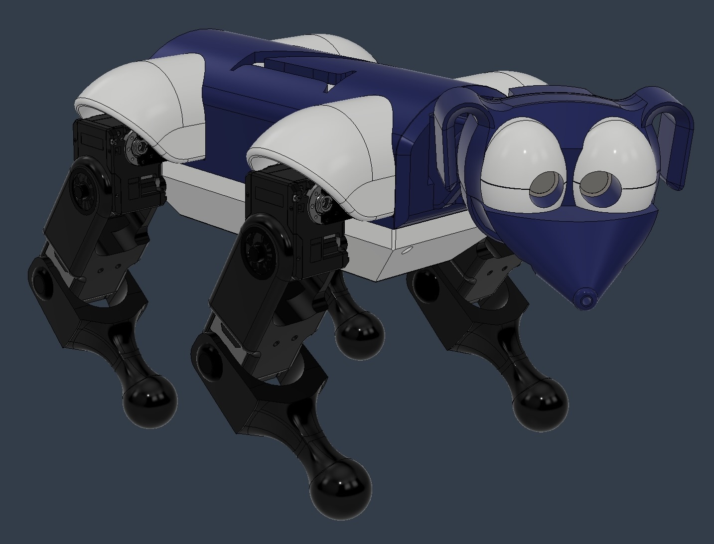
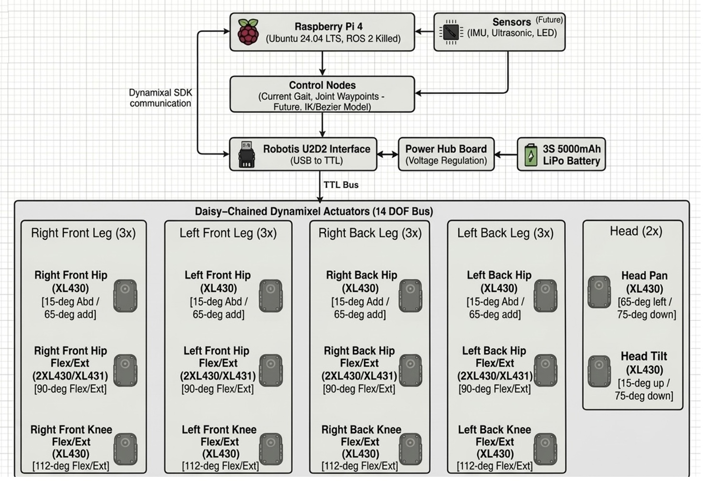

# 🐾 Meet Rudy!

## Executables: 

~ Gait Control/Static Poses: Using static_poses.launch.xml use_rvix:=false, you can launch the dynamixel interface for Rudy and send service calls to the robot to change its joint orientation or command it to walk.

~ Calibration: Using calibrate.launch.xml, you can read the encoder positions at a zero'd joint positions to calibrate each motors encoding to a joint position of 0. A yaml file is created to be used in motor calibration.

~ Rviz Visualization: Using launch_rudy.launch.xml, you can visualize Rudy in simulation at the zero'd joint positions (legs straight down).

## Packages:

- **quadruped_behavior**
  - Implements the **trot gait controller**
  - Generates waypoint trajectories and handles ROS communication
  - Implements whole body static pose joint control
  - Future gait generation progress will be implemented in this package

- **rudy_description**
  - Contains the **URDF model** for the robot
  - Provides tools for **URDF loading and RViz visualization**

- **rudy_lib**
  - Defines **leg and body kinematics**
  - Utilities for **kinematics calculations**
  - **Unit Tests** for leg and body kinematics

- **dynamixel_interfaces**
  - Future Package to move all dynamixel logic to its own package

---

Rudy is a small quadruped robot that I have designed and built completely from scratch. This project focuses on full-stack robotics development — spanning mechanical design, electronics integration, motor control, and ROS-based software architecture for gait and pose control of the quadruped.

---

# Software Architecture

- Raspberry Pi 4 B+
- Ubuntu 24.04 LTS Desktop  
- ROS 2 Kilted
- Robotis U2D2/PowerHub for TTL Communication
- Dynamixel SDK
  

---

# Mechanical Design
## Initial Range of Motion (ROM) Goals

Each leg was designed with:

- Two degrees of freedom at each hip:
  - Abduction/adduction **(15-deg Abd / 65-deg add)**
    - Hip Abad was included to support center-of-mass shifting and balance for future advanced gait control methods.
  - Flexion/extension   **(90-deg Flex/Ext)**

- One degree of freedom at each knee:
  - Flexion/extension **(112-deg Flex/Ext)**

---

# Project Vision

Rudy is intended to evolve into a fully capable research and experimentation robotic platform for:

- Legged locomotion control & Gait generation
- ROS-based robotics architecture  
- Balance and COM shifting strategies  

--- 

**Feel free to check out my project portfolio for additional videos on project Rudy**

https://ncknight-un.github.io/2026/03/10/Rudy-Quadruped-From-Scratch/
